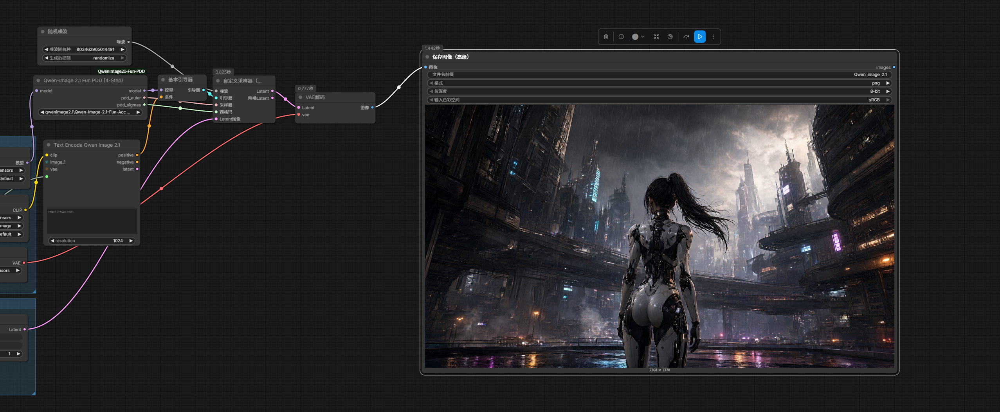
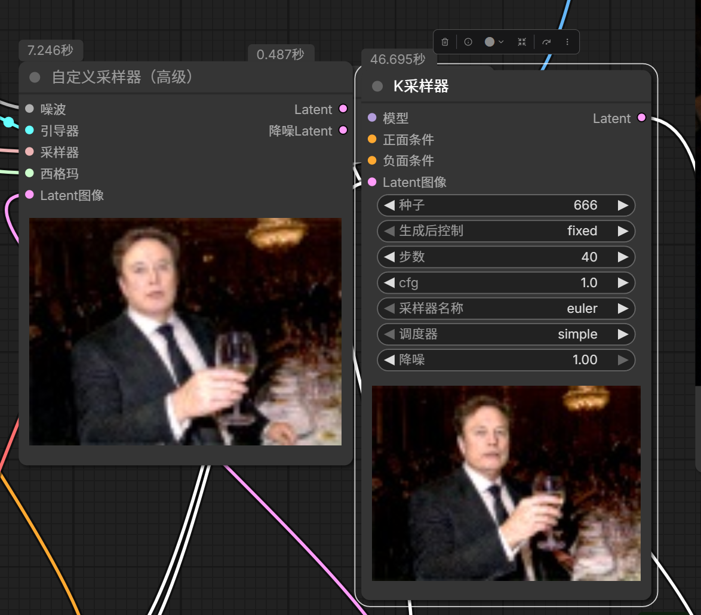

# ComfyUI-QwenImage21-Fun-PDD

**Unofficial native ComfyUI adapter for Qwen-Image 2.1 Fun-Acc four-step PDD exports.**

**English** · [简体中文](README.zh-CN.md) · [Upstream model](https://huggingface.co/alibaba-pai/Qwen-Image-2.1-Fun-Acc-LoRAs)

> Experimental and unofficial — not an Alibaba PAI / VideoX-Fun plugin. Maintainer-provided demos are shown below. Automated validation covers checkpoint mapping, numerical checks and reduced-size native-model CPU/CUDA forwards; independent end-to-end reproduction and controlled upstream comparisons remain unverified.

## Demos

**Local test environment for both screenshots (provided by the maintainer):**

- **GPU:** NVIDIA GeForce RTX 5090 D — **32GB VRAM**
- **System memory:** **128GB DDR5 RAM**

The timings visible in these screenshots were recorded on this local setup and should not be generalized to other hardware.

### Workflow and generated output



A workflow screenshot supplied by the maintainer, showing the PDD node connected to the custom sampling path and its generated output.

### Sampler comparison



The screenshot shows a custom sampler alongside a KSampler configured for 40 steps. On-screen timings are observations from the maintainer's run, **not a controlled benchmark or a universal speed/quality guarantee**; hardware, settings, caching and output sizes can affect results.

[Get the example workflows](#example-workflows).

## Install

From the ComfyUI root:

```bash
git clone https://github.com/slmonker/ComfyUI-QwenImage21-Fun-PDD.git custom_nodes/ComfyUI-QwenImage21-Fun-PDD
```

Restart ComfyUI and refresh the browser. No additional Python packages are required beyond the ComfyUI environment's PyTorch and safetensors.

Download the original `Qwen-Image-2.1-Fun-Acc-4Step.safetensors` from the upstream model repository and place it in a registered ComfyUI LoRA directory. Weights are not distributed here. Only the `qwenimage21_extracted_prefused_v1` four-head export is supported.

Requires native Qwen-Image 2.1 support, ModelPatcher weight wrappers, the DIFFUSION_MODEL wrapper extension, and fused MLP LoRA slice mapping. Tested against ComfyUI commit `1568e6cfd0` with the relevant core files unmodified.

## Use

Search for **PDD** and add **Qwen-Image 2.1 Fun PDD (4-Step)**.

- Class: `QwenImage21FunPDDLoader`
- Category: `loaders / Qwen-Image 2.1`
- Inputs: base `MODEL`, original LoRA filename
- Outputs: patched `MODEL`, fixed PDD Euler `SAMPLER`, fixed `SIGMAS`

Connect all three outputs to **SamplerCustom**, set **cfg=1, add_noise=true**, and connect the positive/negative conditioning and latent from your existing Qwen-Image 2.1 workflow. Decode its output using the existing VAE.

Alternatively use BasicGuider + RandomNoise + SamplerCustomAdvanced. The model output goes to BasicGuider; sampler and sigmas go directly to SamplerCustomAdvanced.

Do not also apply the same file through a regular LoRA loader. Do not replace the supplied schedule with a normal four-step KSampler or an additional shift/scheduler node.

## Example workflows

| Use case | Workflow |
| --- | --- |
| Four-step text-to-image (T2I) | [Fun-PDD-sampling-4steps-t2i.json](examples/Fun-PDD-sampling-4steps-t2i.json) |
| Four-step image editing | [qwenimage2.1-pdd-4steps-edit.json](examples/qwenimage2.1-pdd-4steps-edit.json) |

Both workflows were supplied by the repository maintainer and are included unchanged. Download and drag the JSON into ComfyUI, select the model, text encoder, VAE and LoRA available in your installation, and install any additional custom nodes used by the workflow. Reselect the input image for the editing workflow. Model weights and input images are not bundled.

JSON parsing and node-link consistency were checked when adding these files, with no obvious credentials found. This is not an end-to-end render test on other installations and does not extend the compatibility claims below.

## What it loads

- 231 LoRA pairs, rank=alpha=64, fixed strength 1.
- 65 complete normalization weights as replacement patches, not additive deltas.
- Four output heads from `proj_out.weight`, shape `[4, 64, 4096]`, selected by sigma.
- The fixed sigma sequence `[1, 0.9169867038726807, 0.7861579060554504, 0.5494909882545471, 0]`.

The adapter validates every checkpoint key and tensor shape, including the separate gate/projection halves of fused MLPs. It uses a model clone and ModelPatcher extensions, not core edits or direct forward monkey-patching. Head selection is scoped to each forward using ContextVar, with cleanup on exceptions. Euler state remains FP32; native Qwen-Image 2.1 owns timestep rounding. Prefix KV caching is disabled for the patched clone to match the upstream example.

## Limitations

### 1. Image quality: upstream model limitations

The [upstream model card](https://huggingface.co/alibaba-pai/Qwen-Image-2.1-Fun-Acc-LoRAs#limitations) reports two quality trade-offs relative to the teacher model:

- **Dense, small text:** character strokes can become distorted and legibility can decrease noticeably.
- **Image editing:** some results can be slightly blurrier or darker, with less fine-detail clarity.

These are reported limitations of the upstream accelerated model, not defects established by this adapter's tests. Four-step acceleration should not be interpreted as guaranteed quality equivalence to a longer teacher-model run; inspect outputs for your own use case.

### 2. Narrow model and sampling support

- Supports only the `qwenimage21_extracted_prefused_v1` four-head Fun-Acc export on a **native ComfyUI Qwen-Image 2.1** base model. It is not a general-purpose LoRA converter or loader, and does not support legacy Qwen-Image / Edit 2509 / Edit 2511 or Diffusers pipeline objects.
- Uses **four fixed Euler steps and the bundled sigma sequence**. Changing the step count, replacing or slicing the schedule, adding another sigma shift, or substituting a normal KSampler is outside the supported path and may be rejected. Partial-denoise/img2img workflows that require a shortened schedule are not supported by this fixed sampler.
- LoRA strength is fixed at **1**; there is no strength slider. **CFG=1** is the intended setup. Under normal CFG=1 sampling, negative conditioning does not provide ordinary negative-prompt guidance; other CFG values are not validated.
- Requires the native model and ModelPatcher APIs described above. Older ComfyUI versions or future API changes may require adapter updates.

### 3. Numerical differences and unverified combinations

ComfyUI merges LoRA updates into model weights; the upstream Diffusers implementation evaluates separate low-rank branches. Different operation order, rounding and base-model precision can change results. **Bitwise or pixel-identical reproduction is not promised**, even with the same prompt and seed.

Start with an unmodified BF16 base model. FP8/GGUF and other quantized variants, dynamic VRAM/offload paths, multi-device sharding, torch.compile, masked inpainting, and combinations with other LoRAs, acceleration plugins or model patches have not been comprehensively validated. The T2I example references an INT8 base: this is a maintainer-provided configuration, not a general quantization-compatibility guarantee. Ordinary instruction-based editing demos do not establish masked-inpainting support.

### 4. Memory and performance

Four-step sampling reduces the requested model evaluations; it does **not** remove the need to load the base model, text encoder and VAE. Do not assume this adapter makes the full pipeline fit on a low-VRAM device. Minimum VRAM/RAM requirements, maximum resolution and batch-size limits have not been established.

The demos use **RTX 5090 D 32GB VRAM + 128GB DDR5 RAM**. These are the demo machine's specifications, **not minimum requirements**. Timings in the screenshots are not a controlled end-to-end benchmark and should not be used to claim a universal speedup. Model loading, text encoding, VAE decoding, resolution, caching and other workflow nodes can affect total time. This adapter disables prefix KV caching for its model clone to match the upstream example.

### 5. Examples and validation scope

The example JSON files require the corresponding local models and additional custom nodes; the editing example also needs an input image selected on your machine. Those dependencies and input images are not bundled. The examples are not guaranteed to run unchanged on every installation.

Automated checks cover checkpoint mapping, low-rank math, head switching, model restoration and reduced-size CPU/CUDA forwards. The screenshots are maintainer-supplied demonstrations, **not independent full-model reproduction or a controlled comparison with upstream**. Broad prompt coverage, resolution coverage and compatibility across hardware remain unverified. This is an unofficial experimental integration without an upstream support guarantee.

## Tests

See [TESTING.md](TESTING.md) for reproducible tests and the precise validation scope. When reporting a problem, include the ComfyUI version, base-model precision, hardware, minimal workflow and error traceback. Do not include credentials or private data.

## Provenance and licensing

The model, PDD method and bundled `pdd_config.json` originate from [Alibaba PAI](https://huggingface.co/alibaba-pai/Qwen-Image-2.1-Fun-Acc-LoRAs); see also [VideoX-Fun](https://github.com/aigc-apps/VideoX-Fun). This repository contains no model weights or copied upstream inference scripts.

Upstream materials retain their respective terms. No independent software license has been selected for this repository yet. Public availability does not replace upstream permissions or imply endorsement.
